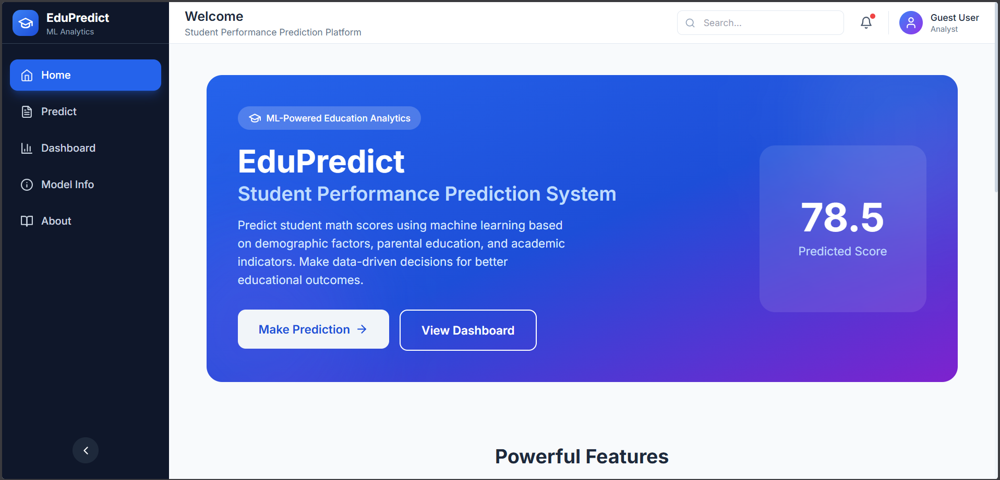
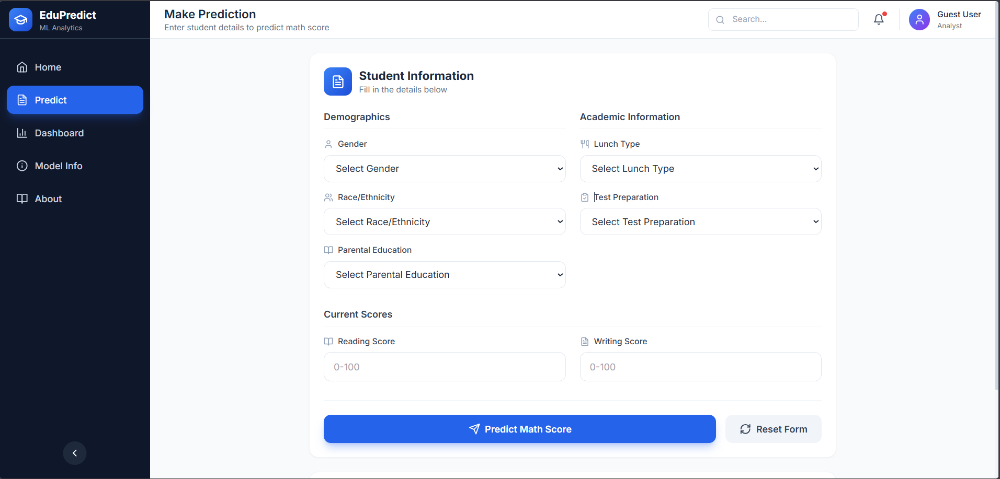
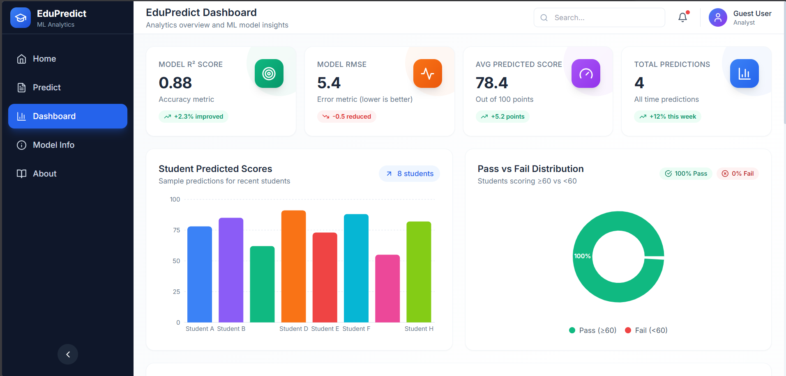
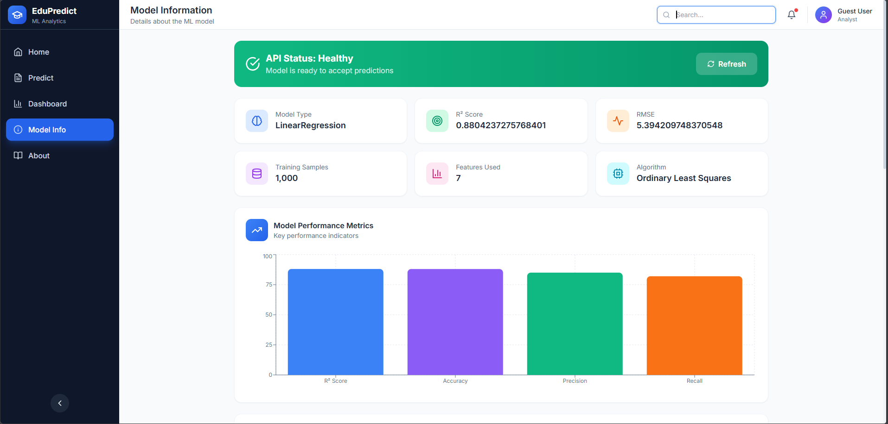
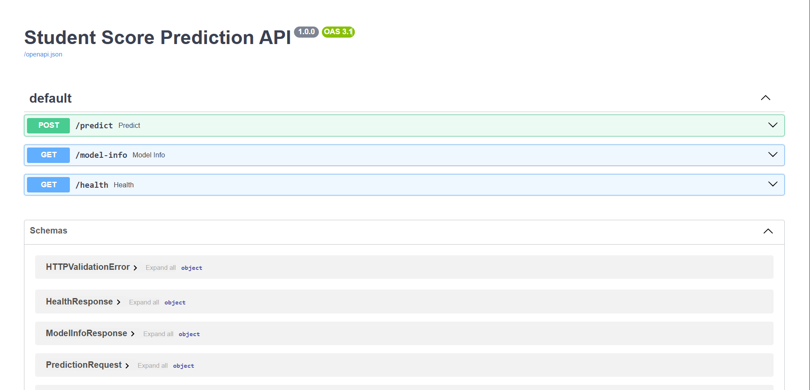

<div align="center">

# 🎓 EduPredict

### Student Performance Prediction System

An end-to-end Machine Learning project that predicts student math performance based on demographic and academic features, deployed with FastAPI and visualized through a React dashboard.

[](https://python.org)
[](https://fastapi.tiangolo.com)
[](https://reactjs.org)
[](https://tailwindcss.com)
[](https://docker.com)
[](LICENSE)

[Demo](#screenshots) • [Features](#-features) • [Installation](#-installation--setup) • [API Docs](#-api-endpoints) • [Contributing](#-contributing)

</div>

---

## 📖 Project Overview

**EduPredict** is a comprehensive machine learning solution designed to predict student academic performance in mathematics based on various demographic and academic factors. The system helps educators and institutions identify students who may need additional support, enabling early intervention strategies.

### Why EduPredict?

- 🎯 **Early Intervention**: Identify at-risk students before they fall behind
- 📊 **Data-Driven Decisions**: Make informed decisions based on predictive analytics
- 🔄 **Real-Time Predictions**: Get instant predictions through the web interface
- 📈 **Performance Monitoring**: Track model accuracy and reliability metrics

---

## ✨ Features

| Feature | Description |
|---------|-------------|
| 🔮 **Real-Time Prediction** | Instant student score predictions through an intuitive web interface |
| 📊 **Analytics Dashboard** | Comprehensive visualization of model performance and prediction statistics |
| 🚀 **FastAPI Backend** | High-performance REST API with automatic documentation |
| 🎨 **Modern UI** | Beautiful React + Tailwind CSS frontend with responsive design |
| 📈 **Interactive Charts** | Dynamic visualizations using Recharts library |
| 💚 **Health Monitoring** | Built-in health check endpoint for system monitoring |
| 🐳 **Docker Ready** | Containerized deployment for consistent environments |
| 🔄 **CI/CD Pipeline** | Automated testing and deployment with GitHub Actions |

---

## 🏗️ System Architecture

```
┌─────────────────────────────────────────────────────────────────────────────┐
│                              EDUPREDICT ARCHITECTURE                         │
├─────────────────────────────────────────────────────────────────────────────┤
│                                                                              │
│    ┌──────────────┐         ┌──────────────┐         ┌──────────────┐       │
│    │              │         │              │         │              │       │
│    │    React     │  HTTP   │   FastAPI    │         │  ML Model    │       │
│    │   Frontend   │ ──────► │   Backend    │ ──────► │  (sklearn)   │       │
│    │              │         │              │         │              │       │
│    └──────┬───────┘         └──────┬───────┘         └──────┬───────┘       │
│           │                        │                        │               │
│           │                        │                        │               │
│           ▼                        ▼                        ▼               │
│    ┌──────────────┐         ┌──────────────┐         ┌──────────────┐       │
│    │  Dashboard   │         │  REST API    │         │  Prediction  │       │
│    │ Visualization│◄────────│  /predict    │◄────────│   Results    │       │
│    │   Charts     │         │  /model-info │         │              │       │
│    └──────────────┘         │  /health     │         └──────────────┘       │
│                             └──────────────┘                                │
│                                                                              │
└─────────────────────────────────────────────────────────────────────────────┘
```

### Data Flow

1. **User Input** → Student information entered via React frontend
2. **API Request** → Data sent to FastAPI backend via REST API
3. **Preprocessing** → Features transformed using trained preprocessor
4. **Prediction** → ML model generates score prediction
5. **Response** → Results returned and visualized on dashboard

---

## 🧠 Machine Learning Pipeline

### Pipeline Stages

```
📥 Data Ingestion
      │
      ▼
🔧 Data Preprocessing
      │
      ▼
⚙️ Feature Engineering
      │
      ▼
🤖 Model Training
      │
      ▼
📏 Model Evaluation
      │
      ▼
🚀 Model Deployment
```

### Model Details

| Aspect | Details |
|--------|---------|
| **Algorithm** | Linear Regression |
| **Features** | 7 input features |
| **Target** | Math Score (0-100) |
| **Metrics** | R² Score, RMSE |
| **Preprocessing** | StandardScaler, OneHotEncoder |
| **Validation** | Train-Test Split (80-20) |

### Input Features

| Feature | Type | Description |
|---------|------|-------------|
| `gender` | Categorical | Student gender (male/female) |
| `race_ethnicity` | Categorical | Ethnic group (A, B, C, D, E) |
| `parental_level_of_education` | Categorical | Parent highest education level |
| `lunch` | Categorical | Lunch type (standard/free-reduced) |
| `test_preparation_course` | Categorical | Course completion status |
| `reading_score` | Numeric | Reading test score (0-100) |
| `writing_score` | Numeric | Writing test score (0-100) |

---

## 🛠️ Tech Stack

### Frontend
- **React 18** - UI library
- **Tailwind CSS** - Styling
- **Recharts** - Data visualization

### Backend
- **Python 3.10+** - Programming language
- **FastAPI** - Web framework
- **Uvicorn** - ASGI server

### Machine Learning
- **Scikit-learn** - ML algorithms
- **Pandas** - Data manipulation
- **NumPy** - Numerical computing

### DevOps
- **Docker** - Containerization
- **GitHub Actions** - CI/CD
- **AWS** - Cloud deployment

---

## 📱 Frontend Pages

| Page | Description | Key Features |
|------|-------------|--------------|
| 🏠 **Home** | Landing page with project overview | Hero section, feature highlights |
| 🔮 **Predict** | Student score prediction form | Input validation, instant results |
| 📊 **Dashboard** | Analytics and visualizations | Charts, statistics, recent predictions |
| ℹ️ **Model Info** | ML model details and metrics | R² Score, RMSE, model explanation |
| 👤 **About** | Project and developer information | Tech stack, contact links |

---

## 🔌 API Endpoints

### Base URL: `http://localhost:8000`

| Endpoint | Method | Description |
|----------|--------|-------------|
| `/predict` | POST | Predict student math score |
| `/model-info` | GET | Get model performance metrics |
| `/health` | GET | Health check endpoint |

### POST /predict

**Request:**
```json
{
  "gender": "female",
  "race_ethnicity": "group B",
  "parental_level_of_education": "bachelor's degree",
  "lunch": "standard",
  "test_preparation_course": "completed",
  "reading_score": 72,
  "writing_score": 74
}
```

**Response:**
```json
{
  "predicted_math_score": 62.8
}
```

### GET /model-info

**Response:**
```json
{
  "model_name": "LinearRegression",
  "r2_score": 0.88,
  "rmse": 5.39
}
```

### GET /health

**Response:**
```json
{
  "status": "ok",
  "model_loaded": true
}
```

📚 **Interactive API Documentation**: [http://localhost:8000/docs](http://localhost:8000/docs)

---

## 📁 Project Structure

```
EduPredict/
│
├── 📂 backend/
│   ├── 📂 app/
│   │   ├── 📂 api/              # API route handlers
│   │   ├── 📂 core/             # Configuration settings
│   │   ├── 📂 models/           # ML model loader
│   │   ├── 📂 schemas/          # Pydantic data models
│   │   ├── 📂 services/         # Business logic
│   │   └── 📄 main.py           # FastAPI application entry
│   │
│   ├── 📂 ml_pipeline/
│   │   ├── 📂 components/       # Data ingestion, transformation, training
│   │   ├── 📂 pipeline/         # Prediction & training pipelines
│   │   └── 📂 utils/            # Logging, exceptions, utilities
│   │
│   ├── 📂 artifacts/            # Trained model & preprocessor
│   └── 📄 requirements.txt      # Python dependencies
│
├── 📂 frontend/
│   ├── 📂 public/               # Static assets
│   ├── 📂 src/
│   │   ├── 📂 components/       # Reusable UI components
│   │   ├── 📂 pages/            # Page components
│   │   └── 📂 context/          # State management
│   └── 📄 package.json          # Node.js dependencies
│
├── 📂 notebooks/                # Jupyter notebooks for EDA
├── 📂 docker/
│   ├── 📄 Dockerfile
│   └── 📄 docker-compose.yml
│
├── 📂 screenshots/              # Application screenshots
├── 📂 .github/workflows/        # CI/CD pipeline
└── 📄 README.md
```

---

## 🚀 Installation & Setup

### Prerequisites

- **Python** 3.10 or higher
- **Node.js** 18 or higher
- **npm** or **yarn**
- **Git**

### 1️⃣ Clone the Repository

```bash
git clone https://github.com/Priyanshu-Ku/mlproject.git
cd mlproject
```

### 2️⃣ Backend Setup

```bash
# Navigate to backend directory
cd backend

# Create virtual environment
python -m venv venv

# Activate virtual environment
# Windows (PowerShell)
.\venv\Scripts\Activate.ps1
# Windows (CMD)
.\venv\Scripts\activate.bat
# Linux/macOS
source venv/bin/activate

# Install dependencies
pip install --upgrade pip
pip install -r requirements.txt

# Start the FastAPI server
uvicorn app.main:app --reload --port 8000
```

✅ Backend running at: **http://localhost:8000**

### 3️⃣ Frontend Setup

```bash
# Open new terminal and navigate to frontend
cd frontend

# Install dependencies
npm install

# Start development server
npm run dev
# OR
npm start
```

✅ Frontend running at: **http://localhost:3000**

### 4️⃣ Docker Deployment (Alternative)

```bash
# Using Docker Compose
cd docker
docker-compose up --build

# Or build manually
docker build -f docker/Dockerfile -t edupredict:latest .
docker run -d -p 8000:8000 --name edupredict edupredict:latest
```

---

## 📸 Screenshots

### 🏠 Home Page


### 🔮 Prediction Page


### 📊 Dashboard


### ℹ️ Model Info


### 📚 Swagger API Documentation


---

## 🔮 Future Improvements

- [ ] 🔐 **User Authentication** – Secure login and user management
- [ ] 💾 **Prediction History** – Store predictions in database for tracking
- [ ] 📤 **Batch Prediction** – Upload CSV files for bulk predictions
- [ ] 🔄 **Model Retraining** – Automated pipeline for model updates
- [ ] ☁️ **Cloud Deployment** – Deploy to AWS/Azure/GCP
- [ ] 📱 **Mobile App** – React Native companion app
- [ ] 🌐 **Multi-language Support** – Internationalization (i18n)
- [ ] 📧 **Email Notifications** – Alert system for at-risk students

---

## 🤝 Contributing

Contributions are welcome! Here is how you can help:

1. **Fork** the repository
2. **Create** a feature branch (`git checkout -b feature/AmazingFeature`)
3. **Commit** your changes (`git commit -m 'Add AmazingFeature'`)
4. **Push** to the branch (`git push origin feature/AmazingFeature`)
5. **Open** a Pull Request

---

## 📄 License

This project is licensed under the **MIT License** - see the [LICENSE](LICENSE) file for details.

---

## 👨‍💻 Author

<div align="center">

### Priyanshu Kumar

[](https://github.com/Priyanshu-Ku)
[](https://linkedin.com/in/priyanshu-ku)
[](mailto:priyanshu.kumar7500@gmail.com)

</div>

---

<div align="center">

**⭐ Star this repository if you found it helpful!**

Made with ❤️ and ☕ by [Priyanshu Kumar](https://github.com/Priyanshu-Ku)

</div>
